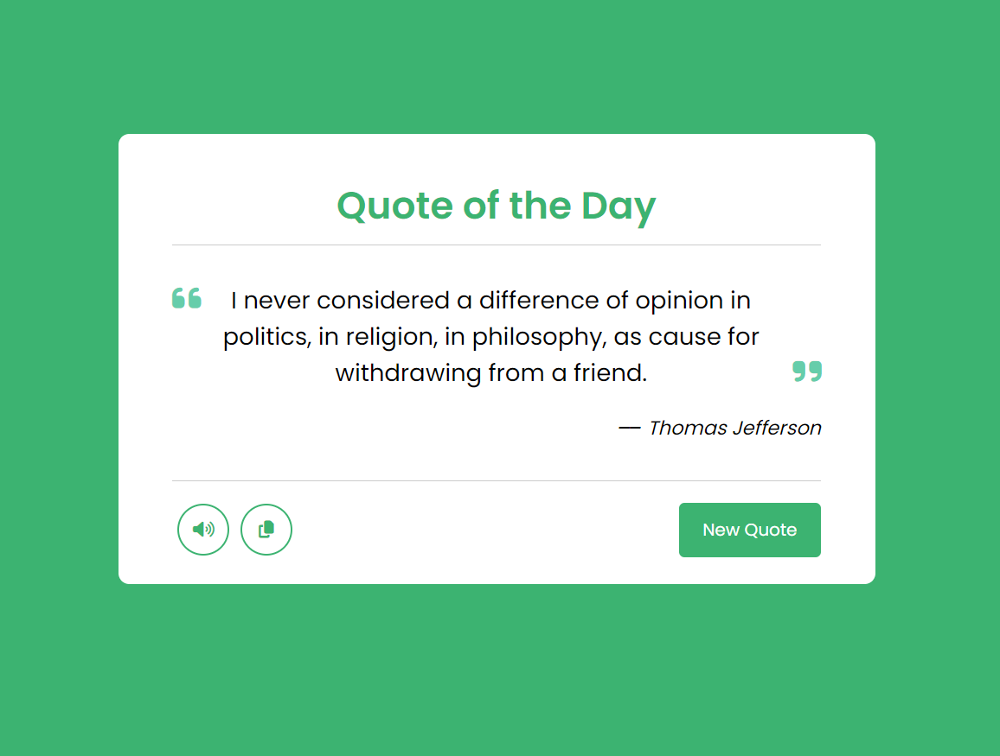

# Random Quote Generator

Welcome to the Random Quote Generator repository! This project is a JavaScript-based web application that generates random quotes fetched from an API. Built with HTML, CSS, and JavaScript, it features a modern UI design for a visually appealing and interactive user experience.

## Preview



## Features

- **Random Quote Generation:** Display a new quote each time the user requests.
- **API Integration:** Fetch quotes from an external API to keep content dynamic.
- **Modern UI Design:** Sleek and responsive design for an engaging user interface.

## Getting Started

To run the Random Quote Generator locally, follow these steps:

1. Clone the repository to your local machine:

   ```bash
   git clone https://github.com/Devsethi3/Random-Quote-Generator.git
   ```

2. Open the `index.html` file in your preferred web browser.

## Usage

1. Click the "New Quote" button to generate a random quote.
2. Share the quote on social media or use it as inspiration.

## Customization

Feel free to customize the project to fit your preferences. You can modify the design, add more features, or integrate additional functionalities.

## Contributing

If you'd like to contribute to this project, please follow these steps:

1. Fork the repository.
2. Create a new branch for your feature or improvement.
3. Make your changes and commit them with descriptive messages.
4. Push your changes to your forked repository.
5. Open a pull request to merge your changes into the main branch.

## API Used

This project utilizes the [Quotable API](https://api.quotable.io/) to fetch random quotes.

Explore the Random Quote Generator, share inspiring quotes, and consider contributing to its development. Thank you for checking out the repository!